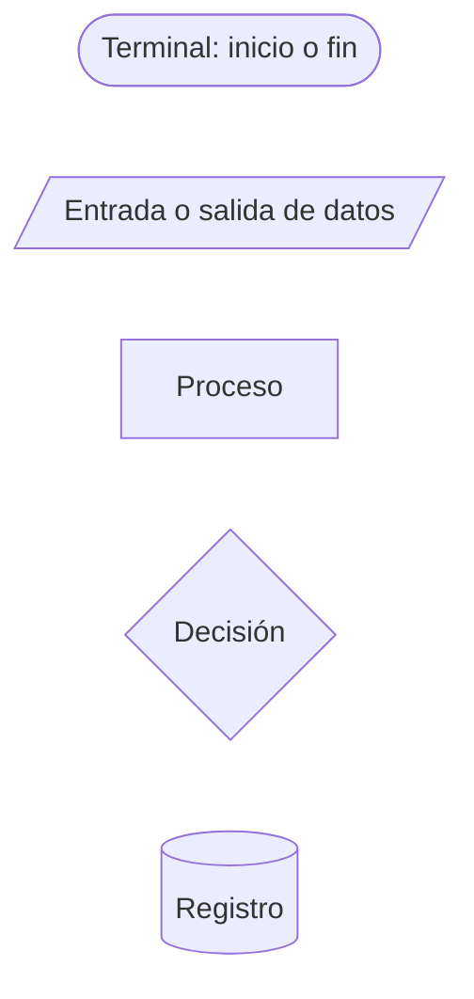
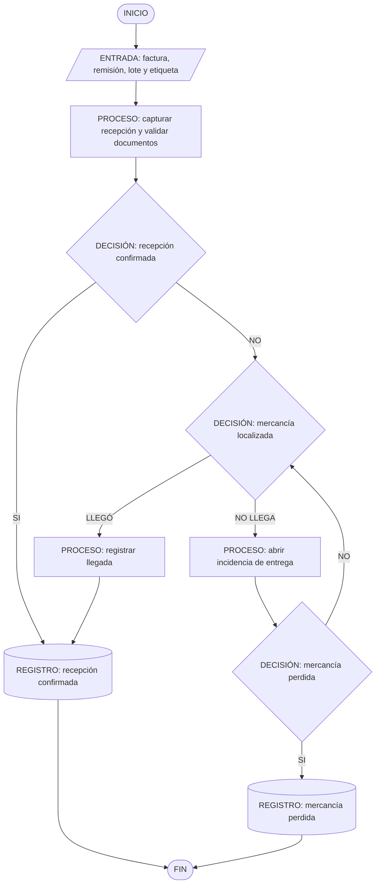
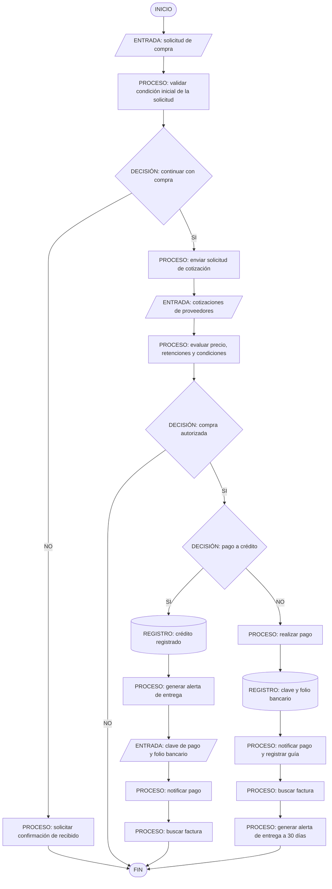
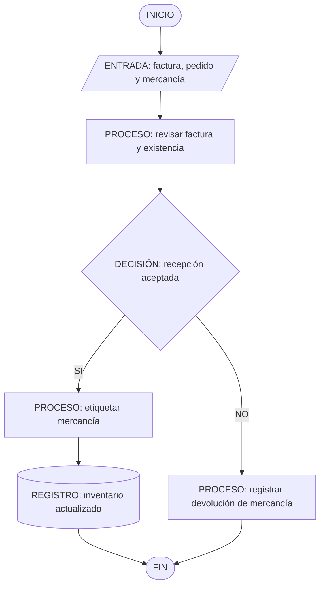
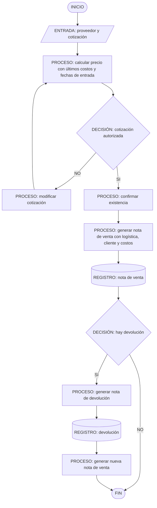
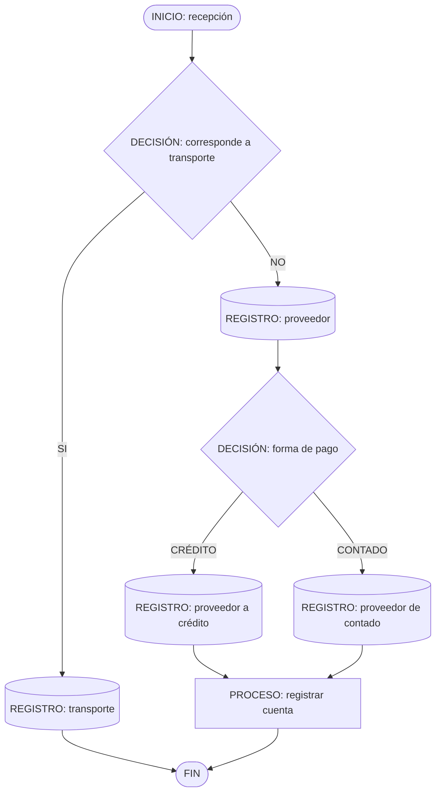

# Diagramas operativos digitalizados

## Leyenda

## 1. Recepción y control de entrega

## 2. Solicitud de compra, cotización, crédito y pago

## 3. Recepción, salida y devolución

### 3.1 Recepción

### 3.2 Salida y nota de venta

### 3.3 Clasificación del proveedor en recepción

